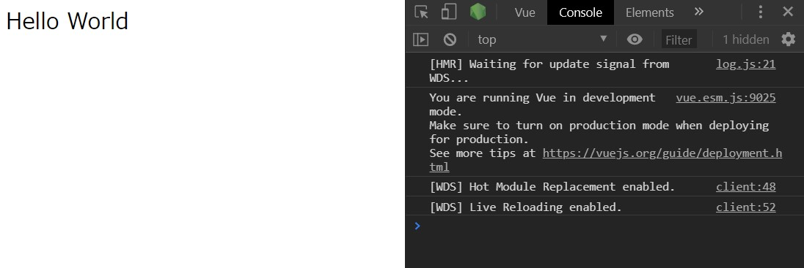

# Vue.js + Webpack

## はじめに

Node.js で Vue.js アプリケーションを開発する際、`@vue/cli`を使用すれば一発で必要なツールが揃う。  
特に`@vue/cli 3`になって Webpack 等の各種設定がラップされ、デフォルトの設定のままで快適に開発できるようになっている。

本稿では Webpack と Babel で各種設定をしながらビルド環境を整える方法をまとめる。

::: tip 目次
[[toc]]
:::

## プロジェクトの作成

```bash
$ npm init
$ mkdir src
$ mkdir src/components
```

以下のようにファイルを作成する。

```bash
$ touch .babelrc.js webpack.config.js /
      src/App.vue src/index.html src/main.js /
      src/components/HelloWorld.vue
```

```
/
├ .babelrc.js
├ package.json
├ webpack.config.js
└ src
  ├ App.vue
  ├ index.html
  ├ main.js
  └ components
    └ HelloWorld.vue
```

## 各種ツールのインストール

### Vue 関連

- `vue`
  - Vue.js 本体
- `vue-loader`
  - 単一ファイルコンポーネントで書かれた`.vue`ファイル内の`<template>`と`<style>`を各種 loader に関連付ける
  - `vue-template-complier`と一緒に使う
- `vue-template-compiler`
  - `.vue`ファイルを Vue 2.0 ベースのレンダー関数に変換する
  - `vue-loader`と一緒に使う

### JS 関連

- `babel-loader`
  - Webpack でバンドルする時に babel でトランスパイル
- `@babel/core`
  - ES6 以降で書かれた JavaScript を ES5 にトランスパイル
  - v7 以降は`babel-core`ではなく、`@babel/core`なので注意
    - [Upgrade to Babel 7 · Babel | Scoped Packages ](https://babeljs.io/docs/en/next/v7-migration#scoped-packages)
- `@babel/preset-env`
  - 最新版の JavaScript をES5 にトランスパイルするためのプリセット

### CSS 関連

- `css-loader`
  - Webpack でバンドルする時に、 `.css`ファイルと`.vue`内の CSS を集めて文字列に変換
- `vue-style-loader`
  - `css-loader` で文字列に変換した CSS を HTML ドキュメントの`<head>`タグ内の`<style>`タグに埋め込む
  - `css-loader`と一緒に使う

### HTML 関連

- `html-webpack-plugin`
  - バンドルした JavaScript ファイルを`index.html`内の`<head>`タグ内の`<script>`タグに埋め込み、`dist`フォルダに出力する

### Webpack 関連

- `webpack`
  - ES Modules の依存関係を解決してファイルをバンドルする
  - `node_modules`内のライブラリ (CommonJS、AMD) をバンドル
  - 各種 loader で`.js`以外のファイルも読み込める
- `webpack-cli`
  - Webpack を CLI で動かすために必要
- `webpack-dev-server`
  - 開発用サーバを立てるために必要

これらを npm でインストールする。

```bash
& npm i --save-dev vue vue-loader vue-template-compiler \
                   babel-loader @babel/core @babel/preset-env \
                   css-loader vue-style-loader \
                   html-webpack-plugin \
                   webpack webpack-cli webpack-dev-server \ 
```

`-dev`オプションをつけることで、`package.json`内の`devDependencies`に 関連付けさせている。

## Webpack の設定

`webpack.config.js`を編集していく。

```js
const path = require('path');
const HtmlWebpackPlugin = require('html-webpack-plugin');
const VueLoaderPlugin = require('vue-loader/lib/plugin');

module.exports = {
  devServer: {
    open: true,
    hot: true,
  },
  entry: './src/main.js',
  module: {
    rules: [
      {
        test: /\.js$/,
        use: 'babel-loader'
      },
      {
        test: /\.vue$/,
        use: 'vue-loader'
      },
      {
        test: /\.css$/,
        use: ['vue-style-loader', 'css-loader']
      }
    ]
  },
  plugins: [
    new HtmlWebpackPlugin({
      template: './src/index.html'
    }),
    new VueLoaderPlugin()
  ],
  resolve: {
    alias: {
      '@': path.resolve(__dirname, 'src/'),
      vue$: 'vue/dist/vue.esm.js'
    },
    extensions: ['*', '.js', '.vue', 'json']
  }
};
```

### devServer

`webpack-dev-server`に関連する設定を指定する。

```js
module.exports = {
  //...
  devServer: {
    open: true
  }
};
```

- `open` - `webpack-dev-server`を立ち上げたとき、ブラウザを自動で開く
- `hot` - ファイルを変更するとアプリケーションを自動で更新する

ホットリロード便利。

### `entry`

依存関係を決定する上での出発点であるエントリーポイントを指定する。

以下のように複数ファイルを指定することも可能。

```js
module.exports = {
  //...
  entry: {
    'app': './src/app.js',
    'main': './src/main.js'
  }
};
```

[Entry Points | webpack | Object Syntax](https://webpack.js.org/concepts/entry-points/#object-syntax)

### `module`

任意の拡張子のファイルに各種ローダーを割り当てる。

`test`プロパティ内の正規表現に合致するファイルを`use`プロパティで指定したローダーで処理する。

Babel 7 以降ではデフォルトで`node_modules`を除外してくれるらしいので、`exclude: /node_modules/`を明示する必要はなくなった。

[Upgrade to Babel 7 (API) · Babel | Config changes](https://babeljs.io/docs/en/v7-migration-api#config-changes)

```js
module.exports = {
  //...
  module: {
    rules: [
      {
        test: /\.js$/,
        use: 'babel-loader',
        // babel 7 ではデフォルトで除外されるので Webpack 側での設定は不要
        // exclude: /node_modules/
        // .babelrc.js で設定するオプションをここに書くこともできる
        options: {
          presets: ['@babel/preset-env']
        }
      },
      {
        test: /\.vue$/,
        use: 'vue-loader'
      },
      {
        test: /\.css$/,
        use: ['vue-style-loader', 'css-loader']
      }
    ]
  }
};
```

ある程度の規模以上になり Babel の設定項目も増えてくると`webpack.config.js`も肥大してくるので、Babel の設定は`.babelrc.js`に書いた方が良さそう。

### `plugins`

各種プラグインを設定する。

```js
const HtmlWebpackPlugin = require('html-webpack-plugin');
const VueLoaderPlugin = require('vue-loader/lib/plugin');

module.exports = {
  //...
  plugins: [
    new HtmlWebpackPlugin({
      template: './src/index.html'
    }),
    new VueLoaderPlugin()
  ]
};
```

`html-webpack-plugin` はデフォルトで`./src/index.ejs`を見に行くので、`./src/index/html`を見に行かせるよう指定する。  

- [jantimon/html-webpack-plugin | options](https://github.com/jantimon/html-webpack-plugin#options)
- [HtmlWebpackPlugin | webpack | Basic Usage](https://webpack.js.org/plugins/html-webpack-plugin/#basic-usage)

`vue-loader`を使うためにはプラグインに追加する必要がある。

- [Getting Started | Vue Loader | Manual Setup](https://vue-loader.vuejs.org/guide/#manual-setup)

### `resolve`

モジュールの依存関係を解決する際の振る舞いを設定する。

```js
const path = require('path');

module.exports = {
  //...
  resolve: {
    alias: {
      '@': path.resolve(__dirname, 'src/'),
      vue$: 'vue/dist/vue.esm.js'
    },
    extensions: ['*', '.js', '.vue', 'json']
  }
};
```

エイリアスを設定することでパスを省略して`import`できる。

```js
// エイリアスなし
import '../src/components/LikeButton.vue'
// エイリアスあり
import '@/components/LikeButton.vue'
```

`@vue/cli`では以上のようなエイリアスがデフォルトで設定されている。

[vue-cli/base.js at dev · vuejs/vue-cli](https://github.com/vuejs/vue-cli/blob/dev/packages/%40vue/cli-service/lib/config/base.js#L48-L55)

また、`extensions`プロパティに拡張子の配列を渡すことで拡張子を省略して`import`できる。

```js
import '@/components/LikeButton';
```

異なる拡張子の同名ファイルがあった場合、配列の前にある要素が優先される。

[Module Resolution | webpack](https://webpack.js.org/concepts/module-resolution/)に依存関係の解決の仕方について詳しく書いてある。

## 各ファイルを準備

Hello World するのに必要なファイルを準備する。

### `.babelrc.js`

これで最新版の ECMAScript を ES5 に変換できる。

```js 
module.exports = {
  presets: ['@babel/preset-env'],
};
```

[](https://babeljs.io/docs/en/config-files)
[](https://babeljs.io/docs/en/configuration)

### `src/App.vue`

```vue
<template>
  <HelloWorld />
</template>

<script>
import HelloWorld from '@/components/HelloWorld';

export default {
  components: {
    HelloWorld
  }
};
</script>
```

### `src/index.html`

```html
<!DOCTYPE html>
<html lang="ja">
  <head>
    <meta charset="UTF-8">
    <meta name="viewport" content="width=device-width">
    <title>Hello World</title>
  </head>
  <body>
    <div id="app"></div>
  </body>
</html>
```

### `src/main.js`

```js
import Vue from 'vue';
import App from './App.vue';

new Vue({
  el: '#app',
  render (h) {
    return h(App);
  }
});
```

### `src/components/HelloWorld.vue`

```vue
<template>
  <div class="hello-world">
    {{ message }}
  </div>
</template>

<script>
export default {
  name: 'HelloWorld',
  data () {
    return {
      message: 'Hello World'
    }
  }
};
</script>

<style scoped>
.hello-world {
  font-size: 24px;
}
</style>
```

## `webpack-dev-server`の立ち上げ

`pakeage.json`に以下のスクリプトを追加する。

```diff
+ "scripts": {
+ "serve": "webpack-dev-server --mode development"
+ }
```

`npm run serve`とすると、`webpack-dev-server`が`localhost:8080`で立ち上がる。

```bash
npm run serve
> webpack-dev-server --mode development

i ｢wds｣: Project is running at http://localhost:8080/
...
```

`webpack.config.js`で`open`オプションを有効にしたので、`http://localhost:8080`が自動で開く。



Hello World できた。

## ビルド

`rimraf`をインストールする。

```bash
$ npm i --save-dev rimraf
```

`rimraf`はUnixコマンド`rm -rf`の Node.js 実装版。`rm -rf`と違って対象ディレクトリがない場合でもエラーを投げないため、ビルドする際のスクリプトを書くのに便利。

`pakeage.json`に以下のスクリプトを追加する。

```diff
+ "scripts": {
+ "build:clean": "rimraf dist"
+ "build": "npm run build:clean && webpack --mode production"
+ }
```

`dist`ディレクトリがあれば削除して、新たに`dist`ディレクトリを吐き出している。

```bash
$ npm run build
```

とすると、`dist`ディレクトリに`index.html`と`main.js`が出力される。

## あとで書くやつ

- TypeScript
- Pug
- Sass (SCSS)
- Stylus

## 参考

- [How to create a Vue.js app using Single-File Components, without the CLI.](https://www.freecodecamp.org/news/how-to-create-a-vue-js-app-using-single-file-components-without-the-cli-7e73e5b8244f/)
- [最新版で学ぶwebpack 4入門 - Babel 7でES2019環境の構築 - ICS MEDIA"](https://ics.media/entry/16028/#webpack-babel-vue)
- [Webpack の考え方について - mizchi's blog](https://mizchi.hatenablog.com/entry/2018/11/26/164523)