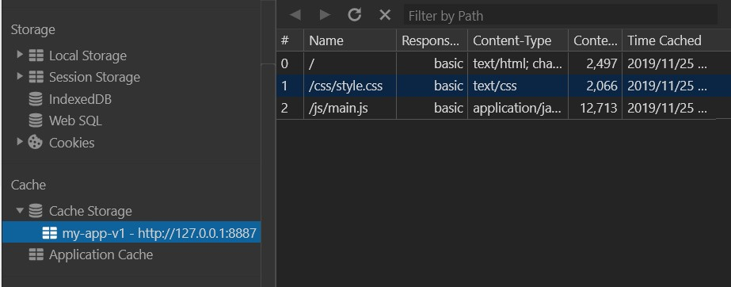
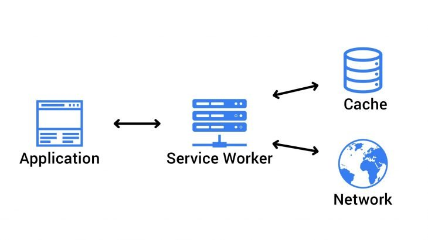

# Service Worker と PWA

## はじめに

::: tip 目次
[[toc]]
:::

## Service Worker

### Service Worker とは

- ブラウザ上にてメインスレッドの裏で動くプロキシサーバのようなもの
- ネイティブアプリで提供されている機能を Webアプリでも実現するために必要
  - キャッシュの操作、バックグラウンド同期、プッシュ通知など
- App Cache API が抱えていたいくつかの問題を克服するために設計されている
- DOM要素にはアクセスすることはできない
  - `Client#postMessage()`メソッド経由でクライアント側に値を送ることはできる
  - Service Worker の処理を記述するスクリプト内で、`self`から自分自身を呼び出せる
- 必要な時にのみ起動するので、値を保持することができない
  - IndexDB などを通じて値を保持しておく
- `https`または`localhost`でしか動作しない
- Chrome、Firefox、Opera が早くから対応し2018年にSafari、iOS Safari、Edge も対応、IE11 は未対応 (2019年11月現在)
  - [Can I use Service Workers?](https://caniuse.com/#feat=serviceworkers)
  - iOS Safari が対応し、主要ベンダーの足並みがそろったことで PWA は Webアプリにおける有力な1つの選択肢になったと言えそう

### ライフサイクル

## PWA

### PWA とは

- ネイティブアプリのような機能を Web (特にモバイル用) でも提供できるようにした Webアプリケーション
- ネイティブアプリと違い、ダウンロード不要でホーム画面に追加できる
- オフラインでも動く
- プッシュ通知
- ネイティブアプリのような UI/UX 体験
- Google が推進してるらしい

## PWA化してみる

### HTTPS通信

PWA化するにあたって必要な Service Worker はセキュリティの関係上、 HTTPS での通信でないと動作しないため、WebアプリをSSL化する必要がある。

- Let's Encrypt で SSL証明書を発行し、Webサーバーに設置
- [Github Pages](https://pages.github.com/) や [Netlify](https://www.netlify.com/) のような SSL に対応しているホスティングサービスを利用

[Service Worker の紹介 | https が必要](https://developers.google.com/web/fundamentals/primers/service-workers?hl=ja#https_%25E3%2581%258C%25E5%25BF%2585%25E8%25A6%2581)

### Service Worker の有効化

[Service Worker の紹介  |  Web Fundamentals  |  Google Developers](https://developers.google.com/web/fundamentals/primers/service-workers?hl=ja)に詳しく書いてある。

#### Service Worker の登録

`index.html`の`script`タグ内か、`main.js`に Service Worker を制御するスクリプト`serviceWorker.js`を登録する処理を書く。

```js
if ('serviceWorker' in navigator) {
  window.addEventListener('load', () => {
    navigator.serviceWorker.register('/serviceWorker.js').then(registration => {
      console.log('ServiceWorker registration successful with scope: ', registration.scope);
    }).catch(e => {
      console.error('ServiceWorker registration failed: ', e);
    });
  });
}
```

`serviceWorker.js`の置いてある階層に Service Worker のスコープ (Service Worker の適用範囲) が設定されるため、`serviceWorker.js`はルートディレクトリに置くとよい。

以下のようにスコープを明示的に設定することも可能。

```js
navigator.serviceWorker.register('/serviceWorker.js', { scope: '/hogehoge' })
```

#### `install`イベント

```js
const CACHE_NAME = 'my-app-v1';
const FILE_LIST_TO_CACHE = [
  '/',
  '/js/main.js',
  '/css/style.css'
];

const registerCache = (cacheName, fileListToCache) => {
  return caches.open(cacheName).then(cache => {
    return cache.addAll(fileListToCache);
  });
};
self.addEventListener('install', e => {
  e.waitUntil(registerCache(CACHE_NAME, FILE_LIST_TO_CACHE));
});
```

キャッシュ名に`my-app-v1`を指定して、`FILE_LIST_TO_CACHE`で指定したファイルをキャッシュに登録している。



Chrome DevTools で Cache Storage にキャッシュが登録されているのが確認できる。

`caches.open()`や`cache#addALL()`は非同期で行われるため、`Promise`の解決を`ExtendableEvent#waitUntil()`で待っている。

`ExtendableEvent`では通常の`Event`インターフェイスに加えて、`waitUntil()`メソッドが提供されている。  
`ExtendableEvent#waitUntil()`は、グローバルスコープにおいて、Service Worker の `install`イベントや`activate`イベントが発火した際に実行されるコールバック関数の`Promise`が解決されるまで待機するメソッドである。

[ExtendableEvent - Web APIs | MDN](https://developer.mozilla.org/en-US/docs/Web/API/ExtendableEvent)

もちろん`async/await`で対処することも可能である。

```js
self.addEventListener('install', async () => {
  await registerCache(CACHE_NAME, FILE_LIST_TO_CACHE);
});
```

#### `fetch`イベント



[How to use a Service Worker to create Progressive Web Applications? - Wisdom Geek](https://www.wisdomgeek.com/development/web-development/service-worker-progressive-web-applications)

スコープ配下にあるページにてネットワークリクエストがあった場合に`fetch`イベントが発火し、リクエストが発生したことが Service Worker に知らされる。

以下のように、キャッシュにリクエストされたファイルがあればそれを返し、なければネットワークを通じてファイルを取得し、キャッシュに追加させることができる。

```js
// キャッシュを追加
const putCache = (cacheName, request, response) => {
  return caches.open(cacheName).then(cache => {
    cache.put(request, response);
  });
};
// キャッシュを取得
const fetchCache = request => {
  return caches.match(request).then(response => {
    if (response) {
      return response
    }
    // request は一度使うと消滅するのでコピーして使う
    const fetchRequest = request.clone();
    return fetch(fetchRequest)
    .then(response => {
      if (response && response.status !== 200 && response.type === 'basic') {
      // response は一度使うと消滅するのでコピーして使う
        const responseToCache = response.clone();
        putCache(CACHE_NAME, request, responseToCache);
      }
      return response;
    })
    .catch(e => {
      console.error(e);
    });
  })
  .catch(e => {
    console.error(e);
  });
};
self.addEventListener('fetch', e => {
  e.respondWith(fetchCache(e.request));
});
```

#### `activate`イベント

```js
const deleteCache = cacheWhiteList => {
  return caches.keys().then(cacheList => {
    Promise.all(
      cacheList.map(cache => {
        if (!cacheWhiteList.includes(cache)) {
          return caches.delete(cache);
        }
      })
    );
  });
};
self.addEventListener('activate', e => {
  e.waitUntil(deleteCache(['pages-cache-v1']));
});
```

### `manifest.json`を設置 (Android chrome 用)

```json
{
  "background_color": "#5bbad5",
  "theme_color": "#5bbad5",
  "display": "standalone",
  "icons": [
    {
        "src": "img/android-chrome-192x192.png",
        "sizes": "192x192",
        "type": "image/png"
    },
    {
        "src": "img/android-chrome-384x384.png",
        "sizes": "384x384",
        "type": "image/png"
    }
  ],
  "name": "\u96fb\u5353",
  "short_name": "\u96fb\u5353",
  "start_url": "./"
}
```

#### 各オプション

- `background_color`
- `theme_color`
- `display`
  - `standalone`
- `icons`
- `start_url`

### iOS

### ファビコンの作成

[Favicon Generator](https://realfavicongenerator.net/)

## まとめ

### 参考

- [Progressive Web App Checklist  |  Google Developers](https://developers.google.com/web/progressive-web-apps/checklist)
- [プログレッシブウェブアプリ詳解 ─ 過去・現在・未来 | HTML5Experts.jp](https://html5experts.jp/agektmr/20527/)
- [Workbox | Google Developers](https://developers.google.com/web/tools/workbox/)
